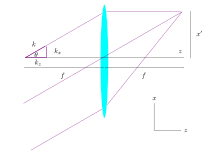

Fourier Hologram
================
The lens performs an optical Fourier transformation of the beam profile between its two focal plane.

Consider focusing a plane wave with a lens as the figure below shows.

With the paraxial approximation, we have:

.. math::
    \theta \approx \frac{k_x}{k} \approx \frac{x}{f}

The wave vector :math:`k` is the multiplication inverse of the wavelength :math:`\lambda`, such that :math:`k = 1/\lambda`.
Note that in some places, the wave vector is defined as :math:`k = 2\pi/\lambda`.
However, in ``pySLM2``, we choose not to append the :math:`2 \pi` factor, so it follows the same convention as most of the implementations of the ``fftfreq`` return.

.. math::
    x = (f \lambda) k_x

As a result, we define a scaling factor ``scaling_factor = wavelength * focal_length`` that converts the wave vector in one focal plane and the corresponding coordinates in the other focal plane.

.. math::
        E_{\mathrm{FP}}(\boldsymbol{x}) = (\lambda f)  \mathcal{F}\left [E_{\mathrm{IP}} (\boldsymbol{x}')\right ](\boldsymbol{k}'=\frac{\boldsymbol{x}}{\lambda f})
